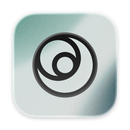
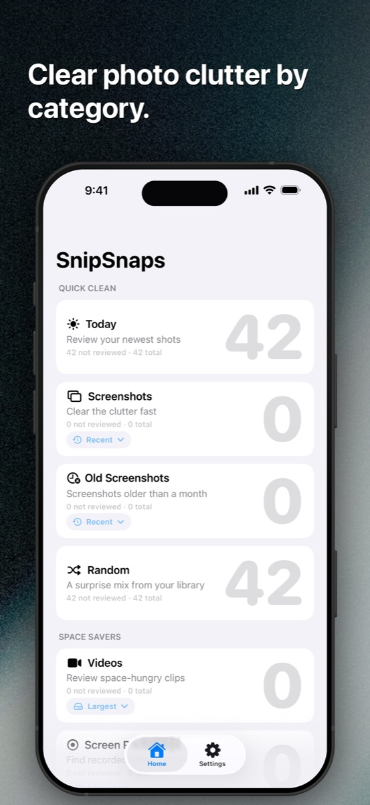
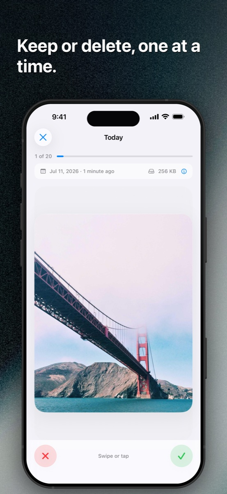
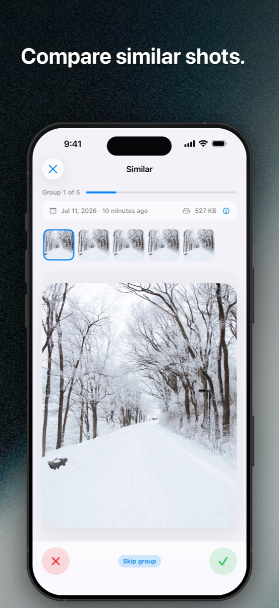
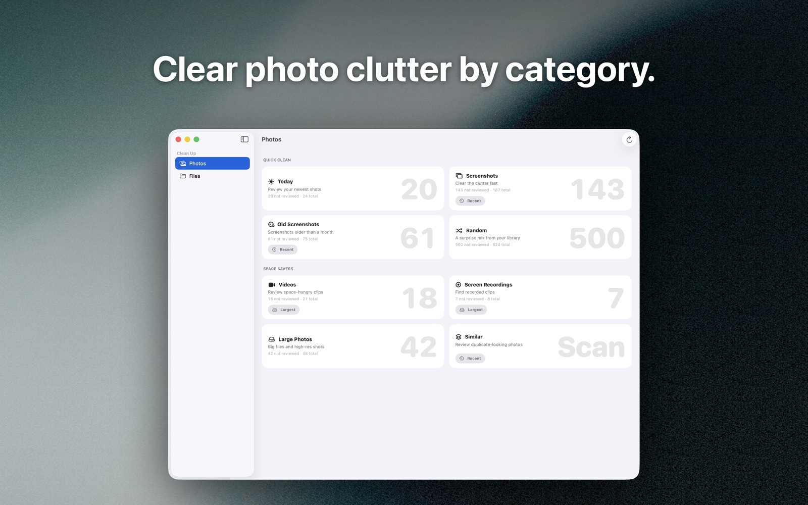
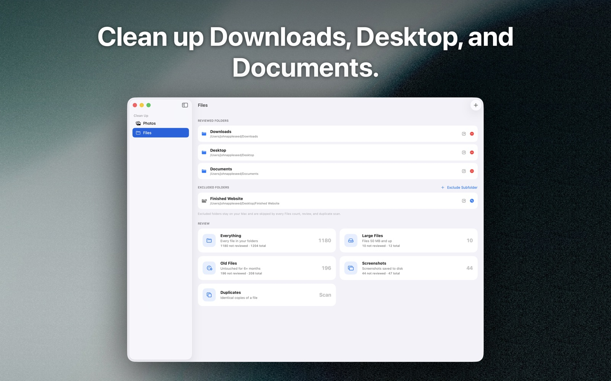

<p align="center">
  
</p>

<h1 align="center">SnipSnaps</h1>

<p align="center">
  Clean up your photos and files in quick, focused review sessions.
</p>

<p align="center">
  <a href="https://apps.apple.com/app/snipsnaps/id6746975535">
    
  </a>
</p>

<p align="center">
  
  
  
  
  
</p>

<p align="center">
  <a href="https://kyter.com/snipsnaps/support/">Support</a>
  ·
  <a href="https://kyter.com/snipsnaps/privacy/">Privacy</a>
  ·
  <a href="CHANGELOG.md">Changelog</a>
  ·
  <a href="LICENSE">License</a>
</p>

<p align="center">
  
  &nbsp;
  
  &nbsp;
  
</p>

SnipSnaps turns cleanup into small sessions you can finish. Choose a category, keep what matters, mark what does not, and confirm once at the end.

The app is free, requires no account, and keeps its work on your device. There are no analytics, ads, or photo uploads.

## What it does

- **Focused photo reviews** — work through recent photos, screenshots, videos, screen recordings, large photos, Live Photos, bursts, old favorites, and more.
- **Similar-shot cleanup** — compare duplicate-looking groups and choose the photo worth keeping.
- **Mac file cleanup** — review folders you explicitly grant by size, age, or type.
- **Recoverable removal** — photos go through the system Photos deletion flow; Mac files move to the Trash.
- **Local by design** — your library is processed on device without an account or server.

## SnipSnaps on Mac



On macOS, SnipSnaps also helps clear Downloads, Desktop, Documents, or any other folder you choose. Access is limited to the folders you grant, and removed files stay recoverable in the Trash.



## Build from source

You will need a Mac with Xcode and the iOS 18.5 and macOS 15 SDKs.

```sh
git clone https://github.com/Kyter-com/SnipSnaps.git
cd SnipSnaps
open SnipSnaps.xcodeproj
```

Select the `SnipSnaps` scheme in Xcode, choose an iPhone, iPad, or Mac destination, and run. The app has no third-party runtime dependencies.

## Project map

- [`SnipSnaps/`](SnipSnaps/) contains the SwiftUI app.
- [`SnipSnapsTests/`](SnipSnapsTests/) contains unit tests.
- [`SnipSnapsUITests/`](SnipSnapsUITests/) contains the real-app screenshot capture flow.
- [`marketing/app-store-screenshots/`](marketing/app-store-screenshots/) contains reproducible App Store marketing assets.
- [`docs/release.md`](docs/release.md) documents the App Store release workflow.

## Contributing

Bug reports, feature ideas, and focused pull requests are welcome. Please read the [contribution guide](CONTRIBUTING.md) and open an issue before a large change so the approach can be discussed.

For security-sensitive reports, use the contact path on the [support page](https://kyter.com/snipsnaps/support/) instead of opening a public issue.

## License

SnipSnaps is available under the [MIT License](LICENSE).

---

<p align="center">
  Made by <a href="https://kyter.com">Kyter</a> for iPhone, iPad, and Mac.
</p>
